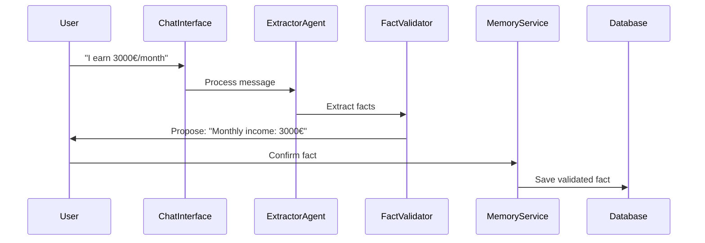
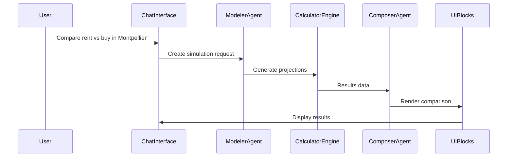
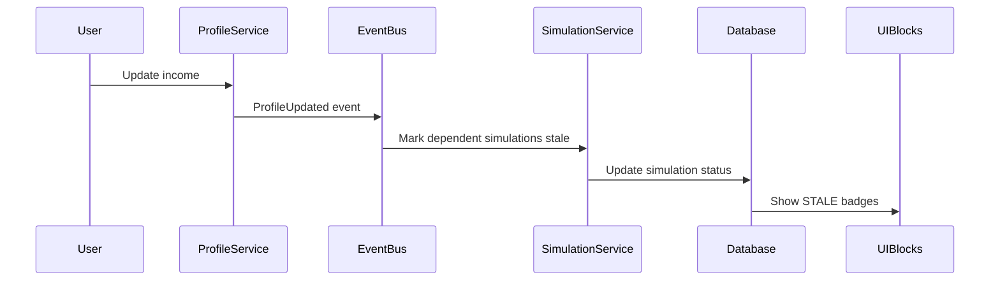

# Architecture Guide
## Fourmi Financial Copilot

### Clean Architecture Overview

Following Clean Architecture principles with Domain-Driven Design, optimized for AI-powered chat interfaces and financial calculations.

```
┌─────────────────────────────────────────────────────────────┐
│                     Interface Layer                          │
│  Next.js App Router │ ShadCN Components │ Chat Interface    │
└─────────────────────────────────────────────────────────────┘
                                │
┌─────────────────────────────────────────────────────────────┐
│                   Application Layer                         │
│    Use Cases │ AI Agents │ TRPC Routes │ Event Handlers    │
└─────────────────────────────────────────────────────────────┘
                                │
┌─────────────────────────────────────────────────────────────┐
│                     Domain Layer                            │
│   Entities │ Value Objects │ Domain Services │ Aggregates   │
└─────────────────────────────────────────────────────────────┘
                                │
┌─────────────────────────────────────────────────────────────┐
│                 Infrastructure Layer                        │
│  Prisma │ AI SDK │ External APIs │ File System │ Cache     │
└─────────────────────────────────────────────────────────────┘
```

### Layer Responsibilities

#### Interface Layer (Next.js)
**Technology Stack:**
- Next.js 14+ with App Router
- ShadCN/ui components with dark theme
- Tailwind CSS for styling
- React Server Components where appropriate

**Key Modules:**
```
src/app/
├── (chat)/              # Chat interface routes
├── (dashboard)/         # Dashboard and comparisons
├── api/                 # TRPC API routes
└── components/
    ├── ui/             # ShadCN base components
    ├── blocks/         # AI-generated UI blocks
    └── chat/           # Chat-specific components
```

#### Application Layer
**Use Cases (Command/Query separation):**
- `CreateProfileUseCase`
- `UpdateProjectUseCase`
- `GenerateSimulationUseCase`
- `CompareSimulationsUseCase`
- `ExtractFactsFromChatUseCase`

**AI Agent Architecture:**
```typescript
interface Agent {
  role: "Extractor" | "Modeler" | "Calculator" | "Composer";
  tools: Tool[];
  systemPrompt: string;
  execute(input: AgentInput): Promise<AgentOutput>;
}
```

**TRPC API Structure:**
```typescript
export const appRouter = router({
  profiles: profileRouter,
  projects: projectRouter,
  simulations: simulationRouter,
  chat: chatRouter,
  agents: agentRouter,
});
```

#### Domain Layer
**Core Principles:**
- Pure business logic, no framework dependencies
- Immutable value objects
- Rich domain models with behavior
- Domain events for inter-aggregate communication

**Module Structure:**
```
src/domain/
├── entities/           # Core business entities
├── value-objects/      # Immutable value types
├── services/          # Domain logic
├── repositories/      # Data access interfaces
├── events/           # Domain events
└── specifications/   # Business rules
```

#### Infrastructure Layer
**External Dependencies:**
- **Database**: Drizzle ORM with Supabase (PostgreSQL + real-time + edge functions)
- **AI**: Vercel AI SDK with OpenAI/Claude
- **Billing & Features**: Schematic for subscription management and feature flags
- **Forms**: AutoForm for dynamic Zod-based form generation
- **Charts**: Tremor for financial visualizations
- **Search**: Perplexity API or similar
- **Validation**: Zod schemas
- **Testing**: Vitest + Playwright

### Key Architectural Patterns

#### 1. Agent-Tool Architecture (AI SDK)
```typescript
// Agent definition with tools
const extractorAgent = createAgent({
  model: openai("gpt-4"),
  tools: {
    validateFact: validateFactTool,
    searchMarketData: searchMarketDataTool,
    calculateAffordability: calculateAffordabilityTool,
  },
  systemPrompt: EXTRACTOR_SYSTEM_PROMPT,
});
```

#### 2. TRPC + Chat Interface Integration
```typescript
// TRPC router with streaming for AI chat
export const chatRouter = createTRPCRouter({
  stream: protectedProcedure
    .input(z.object({ message: z.string(), conversationId: z.string() }))
    .subscription(async function* ({ input, ctx }) {
      // Stream AI agent responses in real-time
      const response = await extractorAgent.stream(input.message);
      
      for await (const chunk of response) {
        yield {
          type: "message_chunk",
          content: chunk.content,
          facts: chunk.extractedFacts,
          uiBlocks: chunk.generatedBlocks,
        };
      }
    }),

  validateFact: protectedProcedure
    .input(FactValidationSchema)
    .mutation(async ({ input, ctx }) => {
      // Human-in-the-loop fact validation
      return await factService.validate(input);
    }),
});

// Chat component using TRPC subscription
function ChatInterface() {
  const { data: stream } = api.chat.stream.useSubscription(
    { conversationId: "current" },
    {
      onData: (chunk) => {
        if (chunk.uiBlocks) {
          setUIBlocks(prev => [...prev, ...chunk.uiBlocks]);
        }
      },
    }
  );
}
```

#### 3. UI Block Composition with AutoForm
```typescript
interface UIBlock {
  type: "MetricCard" | "ComparisonTable" | "Timeline" | "Alert" | "FactValidation";
  props: Record<string, any>;
  schema?: z.ZodSchema; // For AutoForm generation
  interactions?: BlockInteraction[];
}

// Agents return structured UI blocks with dynamic forms
const composerAgent = createAgent({
  tools: {
    renderMetricCard: renderMetricCardTool,
    renderComparison: renderComparisonTool,
    renderFactValidation: createAutoFormTool, // Uses AutoForm + Zod
  }
});
```

#### 3. Event-Driven State Management
```typescript
// Domain events trigger simulation updates
class ProfileUpdatedHandler {
  async handle(event: ProfileUpdatedEvent) {
    const simulations = await this.simulationRepo.findByProfileId(event.profileId);
    
    for (const simulation of simulations) {
      await this.markSimulationStale(simulation.id, event.inputHash);
    }
  }
}
```

#### 4. Repository Pattern with Drizzle + Supabase
```typescript
interface ProfileRepository {
  findById(id: ProfileId): Promise<Profile | null>;
  save(profile: Profile): Promise<void>;
  findByUserId(userId: UserId): Promise<Profile[]>;
  subscribeToChanges(userId: UserId): Promise<RealtimeSubscription>;
}

class DrizzleProfileRepository implements ProfileRepository {
  constructor(
    private db: DrizzleClient,
    private supabase: SupabaseClient
  ) {}
  
  async subscribeToChanges(userId: UserId) {
    // Real-time subscriptions for collaborative features
    return this.supabase
      .channel('profiles')
      .on('postgres_changes', {
        event: '*',
        schema: 'public',
        table: 'profiles',
        filter: `user_id=eq.${userId}`
      }, (payload) => {
        // Handle real-time updates
      });
  }
}
```

#### 5. Feature Flag Integration with Schematic
```typescript
// Middleware for feature-gated routes
export async function middleware(request: NextRequest) {
  const userId = getUserId(request);
  
  if (request.nextUrl.pathname.startsWith('/advanced-simulations')) {
    const hasAccess = await schematic.checkFlag({
      userId,
      flagKey: 'advanced_simulations'
    });
    
    if (!hasAccess) {
      return NextResponse.redirect(new URL('/upgrade', request.url));
    }
  }
}

// AI agent with usage tracking
class TrackedExtractorAgent extends ExtractorAgent {
  async execute(input: string) {
    // Track AI usage for billing
    await schematic.track({
      userId: this.userId,
      event: 'ai_fact_extraction',
      value: 1
    });
    
    return super.execute(input);
  }
}
```

### Main Application Flows

#### 1. Chat → Fact Extraction → Validation


#### 2. Simulation Creation & Calculation


#### 3. Staleness Detection & Updates


### Security & Privacy

**Data Protection:**
- Minimal data collection (no bank account details in v1)
- Encryption at rest for sensitive financial data
- GDPR compliance for EU users
- Secure handling of AI processing data

**API Security:**
- TRPC with TypeScript end-to-end type safety
- Input validation using Zod schemas
- Rate limiting on AI agent calls
- Audit logging for financial calculations

### Performance Considerations

**Optimization Strategies:**
- React Server Components for static content
- Streaming for AI responses
- Optimistic updates for user interactions
- Background calculation updates
- Edge caching for market data

**Monitoring:**
- Financial calculation accuracy tracking
- AI agent response times
- User interaction analytics
- Error rate monitoring

### Testing Strategy

**Test Pyramid:**
```
     ┌─────────────┐
     │  E2E Tests  │ ← User workflows, critical paths
     │   (10%)     │
   ┌─────────────────┐
   │Integration Tests│ ← API endpoints, database
   │     (30%)       │
 ┌─────────────────────┐
 │   Unit Tests        │ ← Pure logic, calculations
 │     (60%)           │
 └─────────────────────┘
```

**Testing Focus Areas:**
- **Financial calculations**: Property-based testing for formula accuracy
- **AI agent behavior**: Mock responses, error handling
- **State transitions**: Simulation status changes
- **User flows**: Chat interactions, fact validation

### Development Workflow

**Phase 1: Foundation**
- Domain models and types (Zod schemas)
- Basic calculation engine with tests
- UI Block system setup
- Simple chat interface

**Phase 2: AI Integration**
- Extractor agent with fact validation
- Modeler agent for simulation creation
- Composer agent for UI block generation
- Integration with Vercel AI SDK

**Phase 3: Advanced Features**
- Comparison engine
- State management for staleness
- Real-time market data integration
- Performance optimization

**Quality Gates:**
- All financial formulas must have unit tests
- AI interactions must have integration tests
- Critical user flows must have E2E coverage
- Type coverage must be >90%