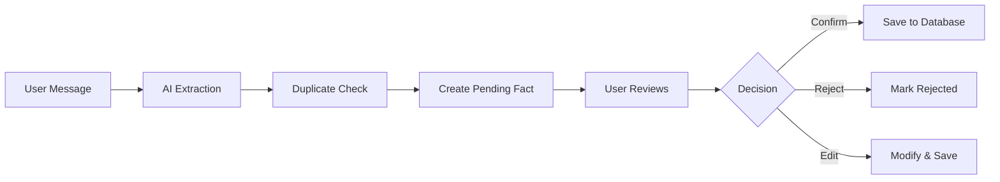
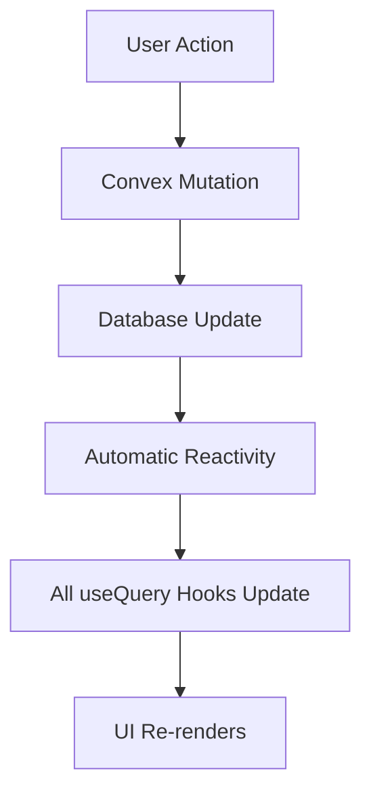
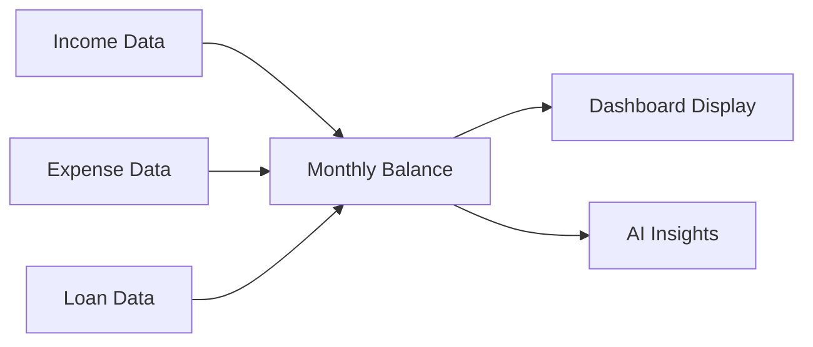

# Convex Architecture (Simplified)
## Fourmi Financial Copilot

### Overview

Fourmi is built with **Convex + Chef** for rapid MVP development. We've simplified from the original Clean Architecture approach to focus on getting features to market quickly.

**Principle**: Make it work → Make it right → Make it fast

### Tech Stack

```
Frontend:
├── Vite + React          # Fast development with HMR
├── TypeScript            # Type safety
├── Tailwind CSS          # Styling with dark theme
└── Convex React hooks    # Real-time data binding

Backend (Convex):
├── Real-time database    # Reactive queries
├── Functions             # Mutations, queries, actions
├── File storage          # CSV uploads
└── Authentication        # Anonymous auth (for now)

AI Integration:
├── OpenAI GPT-4          # Fact extraction
├── AI SDK                # Structured outputs
└── Zod schemas           # Type validation
```

### Database Schema

```typescript
// Core tables (defined in convex/schema.ts)
profiles           # User financial profiles
├── incomes        # Income sources
├── expenses       # Monthly expenses  
├── loans          # Debts and loans
├── pendingFacts   # Facts awaiting validation
├── conversations  # Chat history
└── messages       # Individual messages
```

### Function Architecture

```
convex/
├── schema.ts              # Database schema
├── profiles.ts            # Profile CRUD operations
├── conversations.ts       # Chat management
├── ai.ts                  # AI processing (Node.js actions)
├── lib/                   # Business logic utilities
│   ├── validation.ts      # Input validation, duplicate checks
│   ├── financial.ts       # PMT formula, calculations
│   └── extraction.ts      # Fact extraction helpers
└── domain/                # Domain logic
    ├── facts.ts           # Fact validation workflow
    └── transactions.ts    # Edit/delete operations
```

### Key Workflows

#### 1. Fact Extraction & Validation



#### 2. Real-time Updates



#### 3. Financial Calculations



### Convex Function Types

#### Mutations (Data Changes)
```typescript
// Example: Add income with validation
export const addIncome = mutation({
  args: { profileId, label, amount, isMonthly },
  handler: async (ctx, args) => {
    // 1. Authenticate user
    // 2. Validate input
    // 3. Check duplicates
    // 4. Save to database
  }
});
```

#### Queries (Data Fetching)
```typescript
// Example: Get monthly balance
export const getMonthlyBalance = query({
  args: { profileId },
  handler: async (ctx, args) => {
    // 1. Authenticate user
    // 2. Fetch data
    // 3. Calculate balance
    // 4. Return result
  }
});
```

#### Actions (External APIs)
```typescript
// Example: Process with AI
export const processFinancialMessage = action({
  args: { profileId, message },
  handler: async (ctx, args) => {
    // 1. Call OpenAI API
    // 2. Extract facts
    // 3. Create pending facts
    // 4. Return response
  }
});
```

### Security & Validation

1. **Authentication**: Every function checks `getAuthUserId()`
2. **Authorization**: Profile ownership verified
3. **Input Validation**: Amount ranges, rate limits
4. **Duplicate Prevention**: Semantic similarity checks
5. **Data Integrity**: Store money in cents

### Performance Optimizations

1. **Real-time by Default**: No manual refresh needed
2. **Optimistic Updates**: Planned for edit operations
3. **Batch Operations**: Process multiple facts together
4. **Index Usage**: Efficient queries with indexes

### Deployment

```bash
# Development
npm run dev              # Start frontend + backend

# Production
npx convex deploy        # Deploy to Convex cloud
npm run build            # Build frontend
# Deploy frontend to Vercel/Netlify
```

### Future Enhancements

#### Phase 1 (Current) - FREE Tier
- ✅ Basic income/expense/loan tracking
- ✅ AI fact extraction
- ✅ Duplicate prevention
- ✅ Edit/delete functionality
- 🚧 Fact validation UI
- 📋 Testing infrastructure

#### Phase 2 - PAID Tier
- Real estate projects (rent vs buy)
- PMT calculations for mortgages
- Affordability analysis
- Schematic integration for billing

#### Phase 3 - PREMIUM Tier
- Multiple simulations
- Side-by-side comparisons
- Advanced projections
- Export functionality

### Migration from Legacy

The original architecture used:
- Clean Architecture + DDD
- Drizzle ORM + Supabase
- TRPC for API layer
- Complex DI patterns

We simplified to Convex because:
1. **Faster iteration** - Real-time by default
2. **Less boilerplate** - No API layer needed
3. **Simpler deployment** - One platform
4. **Better DX** - Type safety without complexity

See `/docs/legacy/` for original architecture if we need to scale beyond Convex.